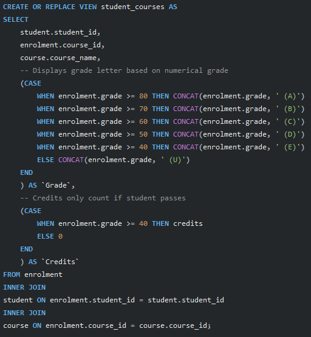
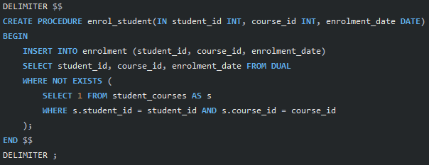
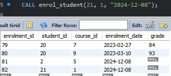

# School Enrolment Database

This database can be used to store data about students and the courses they are enrolled onto.\
There are three tables in the database:

A table for storing students' details - first name, last name, date of birth and email\

A table for storing course details - name, description and how many credits they're worth\

A table for storing enrolment details - student ID, course ID, date enrolled and grade\

For each table, there is a unique primary key given as an ID which auto increments as new records are inserted.

## Table Relationship

In the enrolment table, the fields `student_id` and `course_id` represent foreign keys from the `student` table and `course` table respectively. This relationship is shown in the EER diagram below.

## Sample Data

I have inserted some sample data into each table to demonstrate what the database might look like.

Student Data\

Course Data\

Enrolment Data\

## Updating Grades

When a student is enrolled on a course, they will usually not have a grade yet (which is why `enrolment.grade` can be null). To add/update a student's grade for a particular course, this expression can be used:\

## Views

### Student Course List

If you wanted to see which courses a particular student is enrolled on, you can use the `student_courses` view along with the `SELECT` statement below.

The view can show the course ID, course name, grade and credits earned in that course for a particular student, as well as the total amount of credits earned. The letter grade shown is chosen using a `CASE` statement based on the numerical grade stored in `enrolment` and the credits earned is either 0 if the student has a "U" or the value stored in `course` for that particular course.

### Register

If you wanted to see which students are enrolled on a particular course, you can use the `course_register` view along with the `SELECT` statement below.

The view can show the student ID and full name as well as the grade of each student enrolled on a particular course.

## Enrolling Students

If you wanted to enrol a student onto a course - for example, lets say there was a new student

\

you can use the stored procedure `enrol_student`, which takes the student's ID and the course ID to insert a record into `enrolment`. The procedure will also insert the current date into the record as the date enrolled.

The procedure will only enrol a student onto a course if they are not already enrolled onto it using the `WHERE NOT EXISTS` clause.

\

